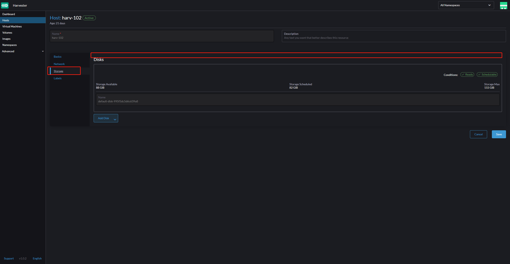
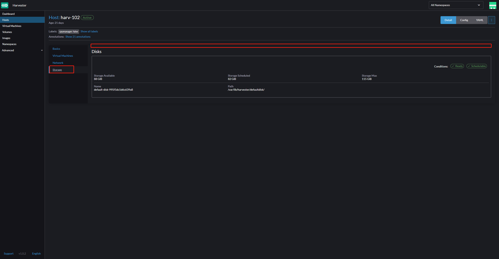
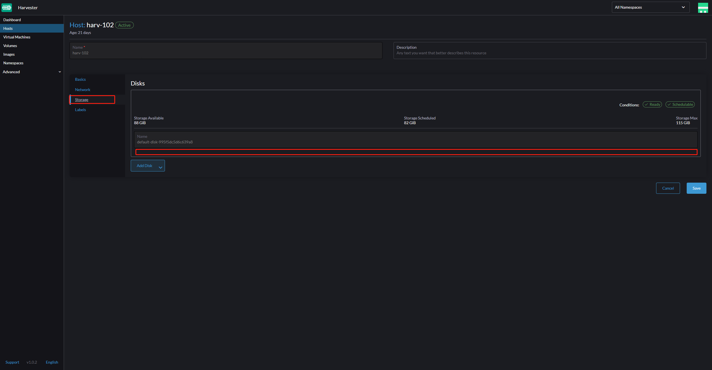
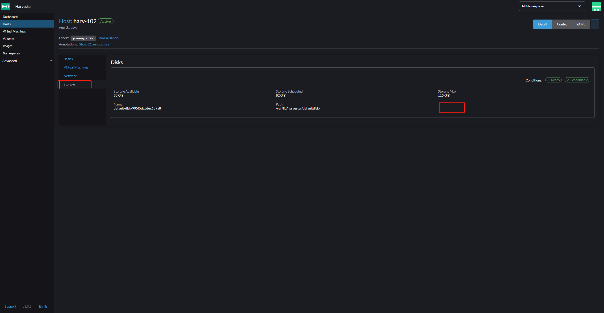
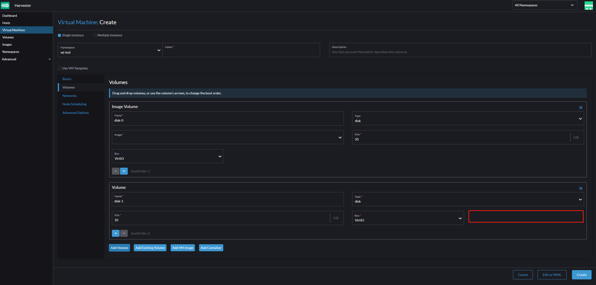

# Storage Tiering

## Summary

### Related Issues
https://github.com/harvester/harvester/issues/2147

## Motivation

### Goals
Allow admins to define storage tiers based on:

+ Node tag selectors
+ Disk tag selectors

### Non-goals [optional]

## Proposal

### User Stories

Use mixed different performance levels storage hardware to

+ optimize cost
+ predictable performance

### User Experience In Detail

#### 1 Node Tag

##### 1.1 Edit Node Tag
`Hosts` > host > `Edit Config` > `Storage`



##### 1.2 Show Node Tag
`Hosts` > host > `Storage`



#### 2 Disk Tag

##### 2.1 Edit Disk Tag
`Hosts` > host > `Edit Config` > `Storage`



##### 2.2 Show Disk Tag
`Hosts` > host > `Storage`



#### 3 Volume
Since disk tag and node tag can have many combinations and the pvc's storageClass must exist before a pvc be created, we need to let users select storageClass during volume creating.

Users can access [Embedded Rancher UI](https://docs.harvesterhci.io/v1.0/troubleshooting/harvester/#access-embedded-rancher) to manage storageClass, or we can add Harvester's `StorageClass` page.

##### 3.1 Create Volume
Select storageClass (default to longhorn).

+ `Volumes` > `Create`（source=New), backing image storageClass need to be filtered out.

+ `Virtual Machines` > `Create` > `Volumes` > `Add Volume`, backing image storageClass need to be filtered out.

+ `Snapshots` > snapshot > `Restore`
  - For snapshot of an image volume, if source storageClass is not found, it can not be restored.
  - For snapshot of other volume, only show storageClasses those have the same provisioner of source storageClass and choose source storageClassName by default. If source storageClass is not found, need show a warning message.
  - For the above two points, save source provisioner, storageClassName,ImageID in snapshot's annotations during volume snapshot.

##### 3.2 Show Volume
```
if provisioner is driver.longhorn.io
  show diskSelector and nodeSelector 
else
  show storageClassName
fi
```

+ `Volumes` > volume


#### 4 Image
Since the storageClass of backing image is created dynamically, we only need to let users select diskSelector and nodeSelector during vm image creating.

##### 4.1 Create Image

Select diskSelector,nodeSelector (default to `any available`)
+ `Images` > `Create`
  
+ `Volumes` > volume > `Export`
  

##### 4.2 Show Image
Show diskSelector,nodeSelector, if it exits

+ `Images` > image
  


### API changes

Add a new field: `extraStorageClassParameters`, type `map[string]string`, to `harvesterhci.io.virtualmachineimages.spec`.
```yaml
spec:
  checksum: ""
  displayName: ubuntu-20.04-minimal-cloudimg-amd64.img
  extraStorageClassParameters:
    nodeSelector: "large"
    diskSelector: "hdd"
    migratable: "true"
    numberOfReplicas: "3"
    staleReplicaTimeout: "30"
```

## Design

### Implementation Overview

1. Specify diskSelector and nodeSelector in `spec.extraStorageClassParameters` when vm image creating or updating.
2. The `vm image mutator` in `harvester-webhook` will autofill other extraStorageClassParameters according to the `image-storage-class-parameters` settings.
3. The `vm image controller` in `harvester` will create or update a backing image storageClass according to the `spec.extraStorageClassParameters`.

#### New Settings `image-default-storage-class-parameters`

Default to `{"numberOfReplicas":"3","staleReplicaTimeout":"30","migratable":"true"}`
```go
ImageDefaultStorageClassParameters   = NewSetting("image-default-storage-class-parameters", `{"numberOfReplicas":"3","staleReplicaTimeout":"30","migratable":"true"}`)
```

#### Add vm image mutator to harvester-webhook


### Test plan
